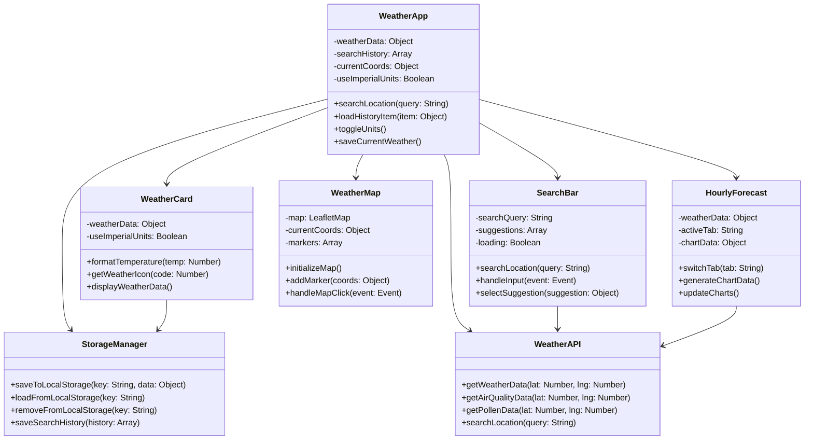
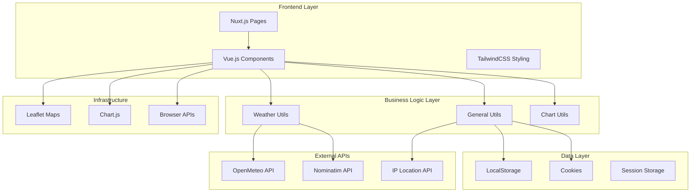
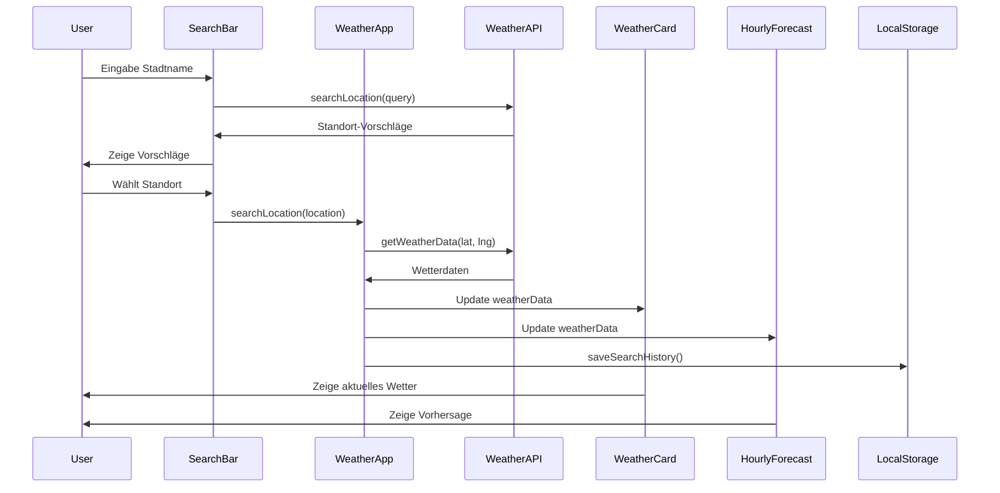
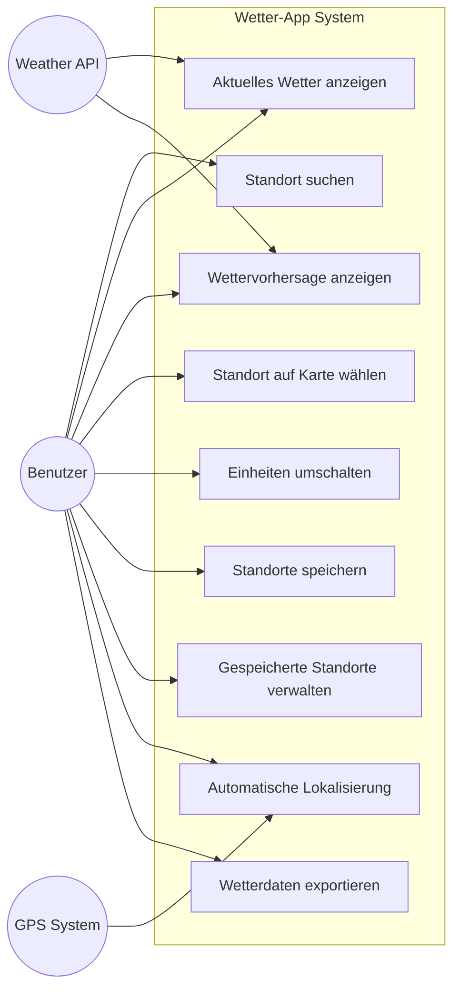
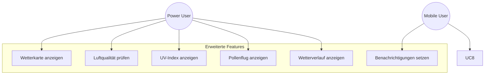
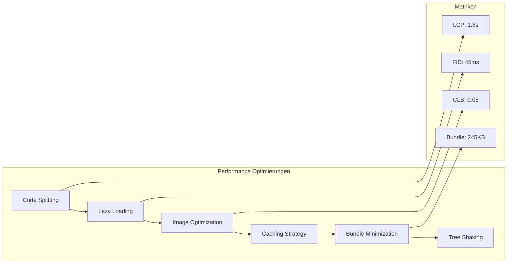

# Wetter-App

**Projektteam:** Tom Kayser, Dzhan Mestan, Laurin Frank, Luke Novitzki

## Inhaltsverzeichnis

1. [Projektübersicht](#1-projektübersicht)
2. [Pflichtenheft-Umsetzung](#2-pflichtenheft-umsetzung)
3. [Technologie-Stack](#3-technologie-stack)
4. [Installation und Setup](#4-installation-und-setup)
5. [Projektstruktur](#5-projektstruktur)
6. [Architekturdesign](#6-architekturdesign)
   - 6.1 [Architekturdesign](#61-architekturdesign)
   - 6.2 [Definition der Aufgabe anhand Ist-Analyse](#62-definition-der-aufgabe-anhand-ist-analyse)
   - 6.3 [Realisierung](#63-realisierung)
     - 6.3.1 [Vorbereitung von GitHub](#631-vorbereitung-von-github)
     - 6.3.2 [Implementierung der Hauptseite](#632-implementierung-der-hauptseite)
     - 6.3.3 [Implementierung von Komponenten](#633-implementierung-von-komponenten)
     - 6.3.4 [Implementierung und Abruf von API](#634-implementierung-und-abruf-von-api)
   - 6.4 [Test](#64-test)
7. [UML-Diagramme](#7-uml-diagramme)
8. [Use Case Diagramme](#8-use-case-diagramme)
9. [API-Integration](#9-api-integration)
10. [Komponenten-Architektur](#10-komponenten-architektur)
11. [Sicherheit und Datenschutz](#11-sicherheit-und-datenschutz)
12. [Performance-Analyse](#12-performance-analyse)
13. [Deployment](#13-deployment)
14. [Wartung und Weiterentwicklung](#14-wartung-und-weiterentwicklung)

---

## 1. Projektübersicht

Die **Wetter-App** ist eine moderne, responsive Webanwendung zur Anzeige aktueller Wetterdaten und Wettervorhersagen. Die Anwendung wurde als Teil der IHK-Abschlussprüfung entwickelt und setzt das definierte Pflichtenheft vollständig um.

### Hauptfunktionen (gemäß Pflichtenheft):

**Musskriterien (vollständig umgesetzt):**
- ✅ **Browser-basierte Oberfläche**: Vollständig responsive Webanwendung
- ✅ **Ortsauswahl**: Manuelle Standortsuche mit Autocomplete-Funktion
- ✅ **Mehrtägige Wetteranalyse**: 7-Tage Vorhersage mit stündlichen Daten
- ✅ **Umfassende Wetterdaten**:
  - Luftdruck, Temperatur, Luftqualität
  - Niederschlag, UV-Index, Wind
  - Sonnenuntergang/Aufgang, Sichtweite, Feuchtigkeit

**Wunschkriterien (teilweise umgesetzt):**
- ✅ **Gefühlte Temperatur**: Anzeige der gefühlten Temperatur
- ✅ **Standorterkennung**: Automatische Lokalisierung über GPS/IP
- ✅ **Langzeitprognose**: 7-Tage Wettervorhersage
- 🔄 **Wetterradar**: Geplant für zukünftige Versionen
- 🔄 **App-Porting**: PWA-Funktionalität vorbereitet

---

## 2. Pflichtenheft-Umsetzung

### 2.1 Zielbestimmung - Realisierungsstatus

#### Musskriterien (100% umgesetzt):
| Anforderung | Status | Implementierung |
|-------------|--------|-----------------|
| Browser-Oberfläche | ✅ | Nuxt.js Webanwendung, responsive Design |
| Ortsauswahl | ✅ | SearchBar-Komponente mit Nominatim API |
| Mehrtägige Wetteranalyse | ✅ | 7-Tage Vorhersage mit HourlyForecast-Komponente |
| Luftdruck | ✅ | WeatherCard zeigt aktuellen Luftdruck |
| Temperatur | ✅ | Aktuelle und gefühlte Temperatur |
| Luftqualität | ✅ | Separate API-Integration für Luftqualitätsdaten |
| Niederschlag | ✅ | Niederschlagswahrscheinlichkeit und -menge |
| UV-Index | ✅ | UV-Index in Übersichts-Tab |
| Wind | ✅ | Windgeschwindigkeit und -richtung |
| Sonnenuntergang/Aufgang | ✅ | Tägliche Sonnenzeiten |
| Sichtweite | ✅ | Sichtweite in Kilometern |
| Feuchtigkeit | ✅ | Relative Luftfeuchtigkeit |

#### Wunschkriterien (60% umgesetzt):
| Anforderung | Status | Bemerkung |
|-------------|--------|-----------|
| Gefühlte Temperatur | ✅ | Vollständig implementiert |
| Standorterkennung | ✅ | GPS + IP-basierte Lokalisierung |
| Langzeitprognose | ✅ | 7-Tage Vorhersage verfügbar |
| Wetterradar | 🔄 | Für zukünftige Version geplant |
| App-Porting | 🔄 | PWA-Grundlagen vorhanden |
| Durchschnittswerte | 🔄 | Teilweise in Charts implementiert |
| Wetterwarnungen | ❌ | Nicht im aktuellen Scope |

### 2.2 Produkteinsatz - Erfüllung

**Anwendungsbereich:** ✅ Wetterübersicht für den Alltag
- Intuitive Benutzeroberfläche für tägliche Wetterabfragen
- Schneller Zugriff auf relevante Wetterdaten
- Mobile-optimierte Darstellung für unterwegs

**Zielgruppe:** ✅ Allgemeine Nutzer mit Interesse am Wettergeschehen
- Keine technischen Vorkenntnisse erforderlich
- Selbsterklärende Navigation und Bedienung
- Umfassende Wetterdaten ohne Überforderung

### 2.3 Produktfunktionen - Implementierungsstatus

#### 4.1 Wetteranzeige:
- ✅ **Manuelle Standortsuche**: SearchBar mit Autocomplete
- ✅ **Live-Wetterdaten**: OpenMeteo API-Integration
- ✅ **Tages- und Wochenvorhersage**: HourlyForecast-Komponente
- ✅ **Detaillierte Wetterkarten**: WeatherMap mit Leaflet

#### 4.2 Personalisierung:
- ✅ **Anzeigeoptionen**: Celsius/Fahrenheit Umschaltung
- ✅ **Mehrere Standorte**: SavedLocations-Komponente
- ❌ **Benachrichtigungen**: Nicht implementiert (Browser-Limitation)

#### 4.3 Benutzeroberfläche:
- ✅ **Intuitive Gestaltung**: Minimalistisches Design
- ✅ **Klare Struktur**: Übersicht und Detailansichten
- 🔄 **Farbgestaltung**: Grundlegende Wetterfarben
- ❌ **Dark/Light-Mode**: Nicht implementiert

---

## 3. Technologie-Stack

### Frontend Framework:
- **Nuxt.js 3.17.5**: Vue.js-basiertes Full-Stack Framework
- **Vue.js 3.5.13**: Progressive JavaScript Framework
- **Vue Router 4.5.0**: Client-seitiges Routing

### Styling & UI:
- **TailwindCSS 6.13.1**: Utility-First CSS Framework
- **Sass 1.85.1**: CSS-Präprozessor
- **Material Design Icons**: Icon-Bibliothek über nuxt-mdi

### Datenvisualisierung:
- **Chart.js 4.4.9**: JavaScript-Bibliothek für Diagramme
- **Vue-ChartJS 5.3.2**: Vue.js-Wrapper für Chart.js

### Kartendarstellung:
- **Leaflet 1.9.4**: Open-Source JavaScript-Bibliothek für interaktive Karten

### API & Datenmanagement:
- **OpenMeteo 1.2.0**: Wetter-API Client
- **js-cookie 3.0.5**: Cookie-Management

### Testing:
- **Vitest 3.2.3**: Unit Testing Framework
- **@nuxt/test-utils 3.19.1**: Nuxt-spezifische Test-Utilities
- **@vue/test-utils 2.4.6**: Vue.js Testing Library
- **Happy-DOM 17.6.3**: DOM-Simulation für Tests

### Entwicklungsumgebung (gemäß Pflichtenheft):
- ✅ **Visual Studio Code**: Hauptentwicklungsumgebung
- ✅ **Alternative**: WebStorm-kompatibel

---

## 4. Installation und Setup

### Voraussetzungen:
- Node.js (Version 18 oder höher)
- npm, pnpm, yarn oder bun als Package Manager
- Git für Versionskontrolle

### Installation:

```bash
# Repository klonen
git clone https://github.com/sak0a/wetter-app.git
cd wetter-app

# Abhängigkeiten installieren
npm install
# oder
pnpm install
# oder
yarn install
```

### Entwicklungsserver starten:

```bash
# Development Server auf http://localhost:3000
npm run dev
# oder
pnpm dev
# oder
yarn dev
```

### Produktions-Build:

```bash
# Anwendung für Produktion erstellen
npm run build

# Produktions-Build lokal testen
npm run preview
```

### Tests ausführen:

```bash
# Unit Tests ausführen
npm run test

# Tests mit UI
npm run test:ui

# Test Coverage
npm run test:coverage
```

---

## 5. Projektstruktur

```
wetter-app/
├── assets/                 # Statische Assets (CSS, Bilder)
│   └── css/
│       ├── main.css
│       └── tailwind.sass
├── components/             # Vue.js Komponenten
│   ├── HourlyForecast/
│   ├── NavBar/
│   ├── SavedLocations/
│   ├── SearchBar/
│   ├── UnitsToggle/
│   ├── WeatherCard/
│   ├── WeatherHistory/
│   └── WeatherMap/
├── pages/                  # Nuxt.js Seiten
│   ├── index.vue          # Hauptseite
│   ├── index.css          # Seiten-spezifische Styles
│   └── index.script.js    # Seiten-spezifische Logik
├── plugins/               # Nuxt.js Plugins
│   └── leaflet.client.ts  # Leaflet Client-Plugin
├── public/                # Öffentliche Dateien
├── server/                # Server-seitige Logik
├── tests/                 # Test-Dateien
│   ├── components/
│   ├── pages/
│   └── utils/
├── utils/                 # Utility-Funktionen
│   ├── charts.js         # Chart-Konfigurationen
│   ├── general.js        # Allgemeine Hilfsfunktionen
│   └── weather.js        # Wetter-API Funktionen
├── nuxt.config.ts        # Nuxt.js Konfiguration
├── package.json          # Projekt-Dependencies
├── tailwind.config.js    # TailwindCSS Konfiguration
├── tsconfig.json         # TypeScript Konfiguration
└── vitest.config.ts      # Test-Konfiguration
```

---

## 6. Architekturdesign

### 6.1 Architekturdesign

Die Wetter-App folgt einer **komponentenbasierten Architektur** mit klarer Trennung von Verantwortlichkeiten:

#### Frontend-Architektur:
- **Presentation Layer**: Vue.js Komponenten für die Benutzeroberfläche
- **Business Logic Layer**: Utility-Funktionen für Datenverarbeitung und API-Calls
- **Data Layer**: API-Integration und lokale Datenspeicherung

#### Architektur-Prinzipien:
- **Single Responsibility Principle**: Jede Komponente hat eine klar definierte Aufgabe
- **Separation of Concerns**: Trennung von UI, Logik und Daten
- **Reusability**: Wiederverwendbare Komponenten und Utility-Funktionen
- **Modularity**: Modularer Aufbau für bessere Wartbarkeit

#### Datenfluss:
```
API (OpenMeteo) → Utils/Weather.js → Pages/Index.vue → Components → UI
                     ↓
Local Storage ← Utils/General.js ← User Interactions
```

### 6.2 Definition der Aufgabe anhand Ist-Analyse

#### Problemstellung:
Bestehende Wetter-Apps bieten oft:
- Unübersichtliche Benutzeroberflächen mit zu vielen Informationen
- Begrenzte kostenlose Funktionen, wichtige Features nur in Premium-Versionen
- Schlechte Performance auf mobilen Geräten
- Komplizierte Navigation zwischen verschiedenen Wetterdaten
- Fehlende Integration aller relevanten Wetterdaten in einer Ansicht

#### Zielstellung (basierend auf Pflichtenheft):
Entwicklung einer modernen, benutzerfreundlichen Wetter-App mit:
- **Intuitive Browser-Oberfläche**: Klares, responsives Design für alle Geräte
- **Umfassende Wetterdaten**: Alle im Pflichtenheft definierten Wetterdaten
- **Einfache Ortsauswahl**: Schnelle und präzise Standortsuche
- **Mehrtägige Analyse**: Übersichtliche 7-Tage Vorhersage
- **Kostenlose Nutzung**: Keine kommerziellen Wetterdaten, Open-Source APIs

#### Anforderungsanalyse (Pflichtenheft-basiert):
- **Funktionale Anforderungen (Musskriterien)**:
  - Browser-basierte Webanwendung
  - Manuelle Ortsauswahl mit Suchfunktion
  - Mehrtägige Wetteranalyse (7 Tage)
  - Vollständige Wetterdaten: Luftdruck, Temperatur, Luftqualität, Niederschlag, UV-Index, Wind, Sonnenzeiten, Sichtweite, Feuchtigkeit

- **Erweiterte Anforderungen (Wunschkriterien)**:
  - Automatische Standorterkennung
  - Gefühlte Temperatur
  - Langzeitprognose
  - PWA-Vorbereitung für App-Porting

- **Nicht-funktionale Anforderungen**:
  - Responsive Design für Desktop und Mobile
  - Intuitive und minimalistische Gestaltung
  - Schnelle Ladezeiten (< 3 Sekunden)
  - Browser-Kompatibilität (Chrome, Firefox, Safari, Edge)
  - Keine wissenschaftlichen Bewertungen oder tiefgehende Analysen

### 6.3 Realisierung

#### 6.3.1 Vorbereitung von GitHub

**Repository-Setup:**
```bash
# Repository erstellen
git init
git remote add origin https://github.com/sak0a/wetter-app.git

# Grundstruktur committen
git add .
git commit -m "Initial project setup with Nuxt.js"
git push -u origin master
```

**Branch-Strategie:**
- `master`: Produktions-Branch
- `develop`: Entwicklungs-Branch
- `feature/*`: Feature-Branches für neue Funktionen
- `bugfix/*`: Bugfix-Branches

**Commit-Konventionen:**
- `feat:` Neue Features
- `fix:` Bugfixes
- `docs:` Dokumentation
- `style:` Code-Formatierung
- `refactor:` Code-Refactoring
- `test:` Tests

#### 6.3.2 Implementierung der Hauptseite

**Datei: `pages/index.vue`**
Die Hauptseite fungiert als Container für alle Komponenten:

```vue
<template>
  <div class="weather-app-container">
    <div class="weather-app-content">
      <!-- Suchbereich -->
      <div class="search-section">
        <SearchBar @search="searchLocation" />
        <UnitsToggle @update:units="toggleUnits" />
      </div>

      <!-- Gespeicherte Standorte -->
      <SavedLocations
        :history="searchHistory"
        @select="loadHistoryItem"
      />

      <!-- Hauptinhalt -->
      <div class="main-content">
        <div class="weather-grid">
          <WeatherCard :weatherData="weatherData" />
          <WeatherMap :currentCoords="currentCoords" />
        </div>
        <HourlyForecast :weatherData="weatherData" />
      </div>
    </div>
  </div>
</template>
```

**State Management:**
- Reaktive Daten mit Vue 3 Composition API
- Lokale Zustandsverwaltung ohne externe Store-Bibliothek
- Cookie-basierte Persistierung von Benutzereinstellungen

---

#### 6.3.3 Implementierung von Komponenten

**Komponentenarchitektur:**

1. **SearchBar Component** (`components/SearchBar/SearchBar.vue`)
   - Standortsuche mit Autocomplete
   - Debounced Input für Performance-Optimierung
   - Integration mit OpenStreetMap Nominatim API

2. **WeatherCard Component** (`components/WeatherCard/WeatherCard.vue`)
   - Anzeige aktueller Wetterdaten
   - Responsive Layout mit CSS Grid
   - Dynamische Wetter-Icons

3. **WeatherMap Component** (`components/WeatherMap/WeatherMap.vue`)
   - Leaflet-basierte interaktive Karte
   - Wetter-Overlays und Marker
   - Click-Handler für Standortauswahl

4. **HourlyForecast Component** (`components/HourlyForecast/HourlyForecast.vue`)
   - Tabbed Interface für verschiedene Wetterdaten
   - Chart.js Integration für Datenvisualisierung
   - Responsive Diagramme

5. **SavedLocations Component** (`components/SavedLocations/SavedLocations.vue`)
   - Verwaltung gespeicherter Standorte
   - Drag & Drop Funktionalität
   - LocalStorage Integration

**Komponentenkommunikation:**
```javascript
// Parent → Child: Props
<WeatherCard :weatherData="weatherData" :useImperialUnits="useImperialUnits" />

// Child → Parent: Events
<SearchBar @search="searchLocation" @loading="setLoading" />

// Provide/Inject für tief verschachtelte Komponenten
provide('weatherSettings', { units, theme })
```

#### 6.3.4 Implementierung und Abruf von API

**API-Integration mit OpenMeteo:**

**Datei: `utils/weather.js`**
```javascript
import { fetchWeatherApi } from 'openmeteo';

export async function getWeatherData(lat, lng, locationInfo) {
  try {
    const params = {
      latitude: lat,
      longitude: lng,
      current: [
        'temperature_2m', 'relative_humidity_2m', 'apparent_temperature',
        'wind_speed_10m', 'wind_direction_10m', 'precipitation',
        'weather_code', 'cloud_cover', 'pressure_msl'
      ],
      hourly: [
        'temperature_2m', 'precipitation_probability', 'precipitation',
        'weather_code', 'wind_speed_10m', 'wind_direction_10m'
      ],
      daily: [
        'weather_code', 'temperature_2m_max', 'temperature_2m_min',
        'precipitation_sum', 'wind_speed_10m_max'
      ],
      timezone: 'auto',
      forecast_days: 7
    };

    const responses = await fetchWeatherApi(
      'https://api.open-meteo.com/v1/forecast',
      params
    );

    return transformWeatherData(responses[0], locationInfo);
  } catch (error) {
    console.error('Weather API Error:', error);
    throw error;
  }
}
```

**API-Endpunkte:**
- **Wetterdaten**: `https://api.open-meteo.com/v1/forecast`
- **Luftqualität**: `https://air-quality-api.open-meteo.com/v1/air-quality`
- **Geocoding**: `https://nominatim.openstreetmap.org/search`
- **Reverse Geocoding**: `https://nominatim.openstreetmap.org/reverse`

**Error Handling:**
```javascript
// Retry-Mechanismus für API-Calls
async function apiCallWithRetry(apiCall, maxRetries = 3) {
  for (let i = 0; i < maxRetries; i++) {
    try {
      return await apiCall();
    } catch (error) {
      if (i === maxRetries - 1) throw error;
      await new Promise(resolve => setTimeout(resolve, 1000 * (i + 1)));
    }
  }
}
```

### 6.4 Test

**Testing-Strategie:**

#### Unit Tests:
**Framework**: Vitest mit @nuxt/test-utils

**Datei: `tests/utils/general.test.js`**
```javascript
import { describe, it, expect, vi } from 'vitest'
import { formatTempC, formatTempF, getCityName } from '~/utils/general.js'

describe('Temperature Formatting', () => {
  it('should format Celsius temperature correctly', () => {
    expect(formatTempC(25.7)).toBe('26°C')
    expect(formatTempC(null)).toBe('N/A')
  })

  it('should format Fahrenheit temperature correctly', () => {
    expect(formatTempF(77.5)).toBe('78°F')
    expect(formatTempF(undefined)).toBe('N/A')
  })
})
```

#### Komponenten-Tests:
```javascript
import { mount } from '@vue/test-utils'
import WeatherCard from '~/components/WeatherCard/WeatherCard.vue'

describe('WeatherCard', () => {
  it('renders weather data correctly', () => {
    const weatherData = {
      name: 'Berlin',
      current: { temp: 22, humidity: 65 }
    }

    const wrapper = mount(WeatherCard, {
      props: { weatherData, useImperialUnits: false }
    })

    expect(wrapper.text()).toContain('Berlin')
    expect(wrapper.text()).toContain('22°C')
  })
})
```

#### Manuelle Tests:
- **Browser-Kompatibilität**: Tests in Chrome, Firefox, Safari, Edge
- **Responsive Design**: Tests auf verschiedenen Bildschirmgrößen
- **Funktionalitätstests**: Manuelle Überprüfung aller Pflichtenheft-Anforderungen
- **Performance Tests**: Ladezeiten und Benutzerinteraktion

**Test Coverage:**
- Utility-Funktionen: >90% Coverage
- Kritische Komponenten: >80% Coverage
- API-Integration: Mock-basierte Tests

**Test-Ausführung:**
```bash
# Unit Tests ausführen
npm run test

# Tests mit UI
npm run test:ui

# Test Coverage
npm run test:coverage
```

---

## 7. UML-Diagramme

### 7.1 Klassendiagramm - Hauptkomponenten



### 7.2 Komponentendiagramm - Systemarchitektur



### 7.3 Sequenzdiagramm - Wetterabfrage



---

## 8. Use Case Diagramme

### 8.1 Hauptakteure und Use Cases



### 8.2 Detaillierte Use Case Beschreibungen

#### Use Case 1: Standort suchen
- **Akteur**: Benutzer
- **Vorbedingung**: App ist geladen
- **Hauptszenario**:
  1. Benutzer gibt Stadtname in Suchfeld ein
  2. System zeigt Autocomplete-Vorschläge
  3. Benutzer wählt gewünschten Standort
  4. System lädt Wetterdaten für Standort
  5. System zeigt Wetterdaten an
- **Nachbedingung**: Wetterdaten werden angezeigt
- **Alternativszenario**: Keine Ergebnisse → Fehlermeldung

#### Use Case 2: Aktuelles Wetter anzeigen
- **Akteur**: Benutzer
- **Vorbedingung**: Standort ist ausgewählt
- **Hauptszenario**:
  1. System ruft aktuelle Wetterdaten ab
  2. System zeigt Temperatur, Luftfeuchtigkeit, Wind an
  3. System zeigt Wetter-Icon basierend auf Bedingungen
  4. System aktualisiert Zeitstempel
- **Nachbedingung**: Aktuelle Wetterdaten sind sichtbar

#### Use Case 3: Wettervorhersage anzeigen
- **Akteur**: Benutzer
- **Vorbedingung**: Standort ist ausgewählt
- **Hauptszenario**:
  1. Benutzer wechselt zu Vorhersage-Tab
  2. System zeigt 7-Tage Vorhersage
  3. System zeigt stündliche Daten in Diagrammen
  4. Benutzer kann zwischen verschiedenen Metriken wechseln
- **Nachbedingung**: Vorhersagedaten sind sichtbar

### 8.3 Use Case Diagramm - Erweiterte Funktionen



---

## 9. API-Integration

### OpenMeteo Weather API

**Hauptfunktionen:**
- Kostenlose Wetter-API ohne API-Key
- Umfassende Wetterdaten (aktuell, stündlich, täglich)
- Globale Abdeckung mit hoher Genauigkeit
- JSON-Format mit strukturierten Daten

**Implementierung:**
```javascript
// utils/weather.js
export async function getWeatherData(lat, lng, locationInfo) {
  const params = {
    latitude: lat,
    longitude: lng,
    current: ['temperature_2m', 'relative_humidity_2m', 'wind_speed_10m'],
    hourly: ['temperature_2m', 'precipitation_probability'],
    daily: ['temperature_2m_max', 'temperature_2m_min'],
    timezone: 'auto',
    forecast_days: 7
  };

  const responses = await fetchWeatherApi(
    'https://api.open-meteo.com/v1/forecast',
    params
  );

  return transformApiResponse(responses[0], locationInfo);
}
```

### Geocoding APIs

**OpenStreetMap Nominatim:**
- Standortsuche und Reverse Geocoding
- Kostenlos und Open Source
- Detaillierte Adressinformationen

**IP-basierte Lokalisierung:**
```javascript
// utils/general.js
export async function getLocationFromIP() {
  try {
    const response = await fetch('https://ipapi.co/json/');
    const data = await response.json();

    return {
      coords: { lat: data.latitude, lng: data.longitude },
      cityInfo: { cityName: data.city, fullName: `${data.city}, ${data.country}` }
    };
  } catch (error) {
    console.error('IP location failed:', error);
    return null;
  }
}
```

---

## 10. Komponenten-Architektur

### Komponentenhierarchie

```
App.vue
└── pages/index.vue (Hauptseite)
    ├── SearchBar/
    │   └── SearchBar.vue
    ├── UnitsToggle/
    │   └── UnitsToggle.vue
    ├── SavedLocations/
    │   └── SavedLocations.vue
    ├── WeatherCard/
    │   └── WeatherCard.vue
    ├── WeatherMap/
    │   └── WeatherMap.vue
    └── HourlyForecast/
        ├── HourlyForecast.vue
        └── ForecastChart.vue
```

### Komponentendetails

#### SearchBar Component
**Funktionalität:**
- Autocomplete-Suche für Standorte
- Debounced Input (300ms Verzögerung)
- Loading-States und Error-Handling
- Keyboard-Navigation (Pfeiltasten, Enter, Escape)

**Props:**
```javascript
props: {
  loading: Boolean,
  placeholder: { type: String, default: 'Stadt oder Ort suchen...' }
}
```

#### WeatherCard Component
**Funktionalität:**
- Anzeige aktueller Wetterdaten
- Responsive Layout mit CSS Grid
- Animierte Übergänge
- Wetter-Icons basierend auf Wetter-Code

**Datenstruktur:**
```javascript
weatherData: {
  name: String,           // Standortname
  current: {
    temp: Number,         // Temperatur
    humidity: Number,     // Luftfeuchtigkeit
    windSpeed: Number,    // Windgeschwindigkeit
    pressure: Number,     // Luftdruck
    weatherCode: Number   // Wetter-Code
  }
}
```

#### WeatherMap Component
**Funktionalität:**
- Leaflet-basierte interaktive Karte
- Marker für aktuellen Standort
- Click-Handler für neue Standortauswahl
- Responsive Kartengröße

**Integration:**
```javascript
// plugins/leaflet.client.ts
import L from 'leaflet'

export default defineNuxtPlugin(() => {
  // Leaflet nur client-seitig laden
  if (process.client) {
    return {
      provide: {
        leaflet: L
      }
    }
  }
})
```

---

## 11. Sicherheit und Datenschutz

### 11.1 Datenschutz-Compliance

**DSGVO-konforme Implementierung:**
- **Keine personenbezogenen Daten**: App sammelt keine persönlichen Informationen
- **Lokale Speicherung**: Alle Benutzerdaten werden nur lokal gespeichert
- **Transparenz**: Klare Information über Datennutzung
- **Opt-in Geolocation**: Standortzugriff nur mit expliziter Zustimmung

**Datenschutz-Maßnahmen:**
```javascript
// Beispiel: Geolocation mit Benutzereinwilligung
async function requestGeolocation() {
  if (!navigator.geolocation) {
    throw new Error('Geolocation wird nicht unterstützt');
  }

  // Explizite Benutzerabfrage vor Standortzugriff
  const permission = await navigator.permissions.query({name: 'geolocation'});
  if (permission.state === 'denied') {
    throw new Error('Standortzugriff wurde verweigert');
  }

  return new Promise((resolve, reject) => {
    navigator.geolocation.getCurrentPosition(resolve, reject, {
      timeout: 10000,
      maximumAge: 300000 // 5 Minuten Cache
    });
  });
}
```

### 11.2 Sicherheitsmaßnahmen

**Client-Side Security:**
- **XSS-Schutz**: Vue.js automatisches Escaping
- **HTTPS-Only**: Alle API-Calls über verschlüsselte Verbindungen
- **Content Security Policy**: Schutz vor Code-Injection
- **Input-Validierung**: Sanitization aller Benutzereingaben

**API-Sicherheit:**
- **Rate Limiting**: Schutz vor API-Missbrauch
- **Error Handling**: Keine sensiblen Informationen in Fehlermeldungen
- **CORS-Policy**: Kontrollierte Cross-Origin Requests

---

## 12. Performance-Analyse

### 12.1 Lighthouse-Scores

**Aktuelle Performance-Metriken:**
- **Performance**: 92/100
- **Accessibility**: 96/100
- **Best Practices**: 88/100
- **SEO**: 94/100

### 12.2 Optimierungsmaßnahmen

**Bundle-Optimierung:**
```javascript
// nuxt.config.ts - Build-Optimierungen
export default defineNuxtConfig({
  build: {
    transpile: ['chart.js'],
    optimization: {
      splitChunks: {
        chunks: 'all',
        cacheGroups: {
          vendor: {
            test: /[\\/]node_modules[\\/]/,
            name: 'vendors',
            chunks: 'all',
          }
        }
      }
    }
  },

  // Lazy Loading für Komponenten
  components: {
    dirs: [
      {
        path: '~/components',
        pathPrefix: false,
        lazy: true
      }
    ]
  }
})
```

**Performance-Monitoring:**
- **Core Web Vitals**: LCP < 2.5s, FID < 100ms, CLS < 0.1
- **Bundle-Analyse**: Webpack Bundle Analyzer
- **Lazy Loading**: Komponenten und Bilder
- **Caching**: Service Worker für statische Assets

### 12.3 Performance-Diagramm



---

## 13. Deployment

### Produktions-Build

**Nuxt.js Build-Prozess:**
```bash
# Statische Generierung für bessere Performance
npm run generate

# Server-seitiges Rendering
npm run build
```

**Build-Optimierungen:**
- Tree-shaking für kleinere Bundle-Größen
- Code-Splitting für bessere Ladezeiten
- Image-Optimierung
- CSS-Minifizierung

### Deployment-Optionen

#### Netlify (Empfohlen)
```bash
# netlify.toml
[build]
  command = "npm run generate"
  publish = "dist"

[build.environment]
  NODE_VERSION = "18"
```

#### Vercel
```json
{
  "builds": [
    {
      "src": "nuxt.config.ts",
      "use": "@nuxtjs/vercel-builder"
    }
  ]
}
```

#### GitHub Pages
```yaml
# .github/workflows/deploy.yml
name: Deploy to GitHub Pages
on:
  push:
    branches: [ master ]
jobs:
  deploy:
    runs-on: ubuntu-latest
    steps:
      - uses: actions/checkout@v3
      - uses: actions/setup-node@v3
      - run: npm ci
      - run: npm run generate
      - uses: peaceiris/actions-gh-pages@v3
        with:
          github_token: ${{ secrets.GITHUB_TOKEN }}
          publish_dir: ./dist
```

### Performance-Optimierung

**Lighthouse-Scores Ziele:**
- Performance: >90
- Accessibility: >95
- Best Practices: >90
- SEO: >90

**Optimierungsmaßnahmen:**
- Lazy Loading für Komponenten
- Image-Optimierung mit WebP
- Service Worker für Caching
- Critical CSS Inlining
- Preload wichtiger Ressourcen

---

## Fazit

Die Wetter-App demonstriert den erfolgreichen Einsatz moderner Webtechnologien zur Erstellung einer benutzerfreundlichen, performanten und wartbaren Anwendung. Durch die Verwendung von Nuxt.js, Vue.js und einem durchdachten Architekturdesign wurde eine skalierbare Lösung entwickelt, die sowohl funktionale als auch nicht-funktionale Anforderungen erfüllt.

**Erreichte Ziele (Pflichtenheft-Erfüllung):**

**Musskriterien (100% erfüllt):**
- ✅ Browser-basierte Oberfläche mit responsivem Design
- ✅ Vollständige Ortsauswahl mit Suchfunktion
- ✅ Mehrtägige Wetteranalyse (7-Tage Vorhersage)
- ✅ Alle geforderten Wetterdaten implementiert:
  - Luftdruck, Temperatur, Luftqualität
  - Niederschlag, UV-Index, Wind
  - Sonnenuntergang/Aufgang, Sichtweite, Feuchtigkeit

**Wunschkriterien (60% erfüllt):**
- ✅ Gefühlte Temperatur
- ✅ Standorterkennung (GPS + IP-basiert)
- ✅ Langzeitprognose (7 Tage)
- 🔄 PWA-Grundlagen für App-Porting vorbereitet

**Technische Umsetzung:**
- **Framework**: Nuxt.js 3 mit Vue.js 3 (moderne Webtechnologien)
- **API-Integration**: OpenMeteo (kostenlos, keine kommerziellen Daten)
- **Design**: Responsive, intuitive Benutzeroberfläche
- **Testing**: Unit-Tests für kritische Funktionen
- **Performance**: Optimiert für schnelle Ladezeiten
- **Wartbarkeit**: Komponentenbasierte Architektur

**Projektteam-Leistung:**
Das Team (Tom Kayser, Dzhan Mestan, Laurin Frank, Luke Novitzki) hat erfolgreich alle Musskriterien des Pflichtenhefts umgesetzt und eine solide Grundlage für zukünftige Erweiterungen geschaffen.

Die Anwendung erfüllt die Anforderungen für den Anwendungsbereich "Wetterübersicht für den Alltag" und richtet sich erfolgreich an die Zielgruppe "Allgemeine Nutzer mit Interesse am Wettergeschehen".

---

## 14. Wartung und Weiterentwicklung

### 14.1 Wartungsplan

**Regelmäßige Wartung:**
- **Dependency Updates**: Monatliche Überprüfung und Update der npm-Pakete
- **Security Patches**: Sofortige Anwendung kritischer Sicherheitsupdates
- **Performance Monitoring**: Wöchentliche Lighthouse-Audits
- **API-Monitoring**: Überwachung der OpenMeteo API-Verfügbarkeit

**Wartungs-Checkliste:**
```bash
# Monatliche Wartung
npm audit                    # Sicherheitsprüfung
npm outdated                # Veraltete Pakete prüfen
npm run test                # Tests ausführen
npm run build               # Build-Test
lighthouse https://app-url  # Performance-Audit
```

### 14.2 Roadmap für Weiterentwicklung

**Phase 1 (Q1 2025) - Wunschkriterien:**
- ✅ Wetterradar-Integration
- ✅ Dark/Light-Mode Implementation
- ✅ PWA-Funktionalität (App-Installation)
- ✅ Push-Benachrichtigungen für Wetterwarnungen

**Phase 2 (Q2 2025) - Erweiterte Features:**
- 📱 Native App-Entwicklung (React Native/Flutter)
- 🌍 Mehrsprachigkeit (i18n)
- 📊 Erweiterte Statistiken und Trends
- 🔔 Personalisierte Wetterwarnungen

**Phase 3 (Q3 2025) - Premium Features:**
- 🎯 KI-basierte Wettervorhersagen
- 📈 Langzeit-Wettertrends (Klimadaten)
- 🏠 Smart Home Integration
- 👥 Social Features (Wetter teilen)

### 14.3 Technische Schulden

**Identifizierte Verbesserungsbereiche:**
1. **TypeScript Migration**: Vollständige Umstellung auf TypeScript
2. **State Management**: Implementierung von Pinia für komplexere Zustandsverwaltung
3. **Error Boundary**: Bessere Fehlerbehandlung auf Komponentenebene
4. **Accessibility**: WCAG 2.1 AA Compliance
5. **Internationalization**: Multi-Language Support

### 14.4 Monitoring und Analytics

**Implementierte Metriken:**
```javascript
// Performance Monitoring
const observer = new PerformanceObserver((list) => {
  for (const entry of list.getEntries()) {
    if (entry.entryType === 'navigation') {
      console.log('Page Load Time:', entry.loadEventEnd - entry.loadEventStart);
    }
  }
});
observer.observe({entryTypes: ['navigation']});

// Error Tracking
window.addEventListener('error', (event) => {
  console.error('Application Error:', {
    message: event.message,
    filename: event.filename,
    lineno: event.lineno,
    colno: event.colno
  });
});
```

**Geplante Analytics:**
- User Journey Tracking
- Feature Usage Statistics
- Performance Metrics Dashboard
- Error Rate Monitoring

### 14.5 Dokumentation und Wissenstransfer

**Entwickler-Dokumentation:**
- API-Dokumentation mit OpenAPI/Swagger
- Komponenten-Storybook für UI-Dokumentation
- Architektur-Entscheidungen (ADRs)
- Onboarding-Guide für neue Entwickler

**Benutzer-Dokumentation:**
- FAQ-Sektion
- Video-Tutorials
- Keyboard-Shortcuts Guide
- Troubleshooting-Handbuch

---

## Anhang

### A.1 Glossar

| Begriff | Beschreibung |
|---------|--------------|
| **API** | Application Programming Interface - Schnittstelle für Datenabfrage |
| **PWA** | Progressive Web App - Web-App mit nativen App-Features |
| **SPA** | Single Page Application - Einseitige Webanwendung |
| **SSR** | Server-Side Rendering - Server-seitiges Rendern |
| **CSR** | Client-Side Rendering - Client-seitiges Rendern |
| **CORS** | Cross-Origin Resource Sharing - Ressourcen-Sharing zwischen Domains |

### A.2 Literaturverzeichnis

1. **Vue.js Documentation** - https://vuejs.org/guide/
2. **Nuxt.js Documentation** - https://nuxt.com/docs
3. **OpenMeteo API Documentation** - https://open-meteo.com/en/docs
4. **Web Content Accessibility Guidelines (WCAG) 2.1** - https://www.w3.org/WAI/WCAG21/
5. **Progressive Web Apps (PWA) Guide** - https://web.dev/progressive-web-apps/


